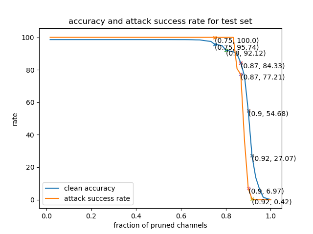

# Lab 3

```bash
├── architecture.py
├── data
│   ├── bd
│   │   ├── bd_test.h5
│   │   └── bd_valid.h5
│   ├── cl
│   │   ├── test.h5
│   │   └── valid.h5
│   └── data.txt
├── eval.py
├── lab3.py
├── model_B_10.h5
├── model_B_2.h5
├── model_B_4.h5
├── models
│   ├── bd_net.h5
│   └── bd_weights.h5
├── README.md
└── utils.py
```

## I. Dependencies
   1. Python 3.6.9
   2. Keras ~~2.3.1~~  2.4.3
   3. Numpy 1.16.3
   4. Matplotlib 2.2.2
   5. H5py 2.9.0
   6. TensorFlow-gpu ~~1.15.2~~ 2.4.1
   
## II. Data
   1. Download the validation and test datasets from [here](https://drive.google.com/drive/folders/1Rs68uH8Xqa4j6UxG53wzD0uyI8347dSq?usp=sharing) and store them under `data/` directory.
   2. The dataset contains images from YouTube Aligned Face Dataset. We retrieve 1283 individuals and split into validation and test datasets.
   3. bd_valid.h5 and bd_test.h5 contains validation and test images with sunglasses trigger respectively, that activates the backdoor for bd_net.h5. 

## III. Evaluating the Backdoored Model
   1. The DNN architecture used to train the face recognition model is the state-of-the-art DeepID network. 
   2. To evaluate the backdoored model, execute `eval.py` by running:  
      `python3 eval.py <clean validation data directory> <poisoned validation data directory> <model directory>`.
      
      E.g., `python3 eval.py data/cl/valid.h5 data/bd/bd_valid.h5 models/bd_net.h5`. This will output:
      Clean Classification accuracy: 98.64 %
      Attack Success Rate: 100 %

## IV. Repare the network and Evaluate

Run ```python3 lab3.py```.


1. Plot the accuracy on clean test data and the attack success rate:



B' model will be saved in ```model_B_{2, 4, 10}.h5```.
3. Evaluate with test set:

Load the B and B' as a GoodNet G. Evaluate the performance.

| GoodNet_G_model | clean_test_acc | bad_attack_rate |
|-----------------|----------------|-----------------|
| **acc_drop_2%**     | 95.744349      | 100.000000      |
| **acc_drop_4%**     | 92.120031      | 99.984412       |
| **acc_drop_10%**    | 84.333593      | 77.209665       |

The result match the pruning strategy. When pruning it shows:

```
The clean accuracy is:  95.75647354291158
The attack success rate is:  100.0

The clean accuracy is:  92.10184463497012
The attack success rate is:  99.9913397419243

The clean accuracy is:  84.44617649605958
The attack success rate is:  77.015675067117
```

As the result shows in the picture if we prune more channels, the attack success rate 
will drop (if pruning 92% channels, we almost defense all bad data but the accuracy will 
be also low). That is, the backdoor is disabled with some compromising of 
clean set accuracy.

## V. Important Notes
Please use only clean validation data (valid.h5) to design the pruning defense. And use test data (test.h5 and bd_test.h5) to evaluate the models. 
